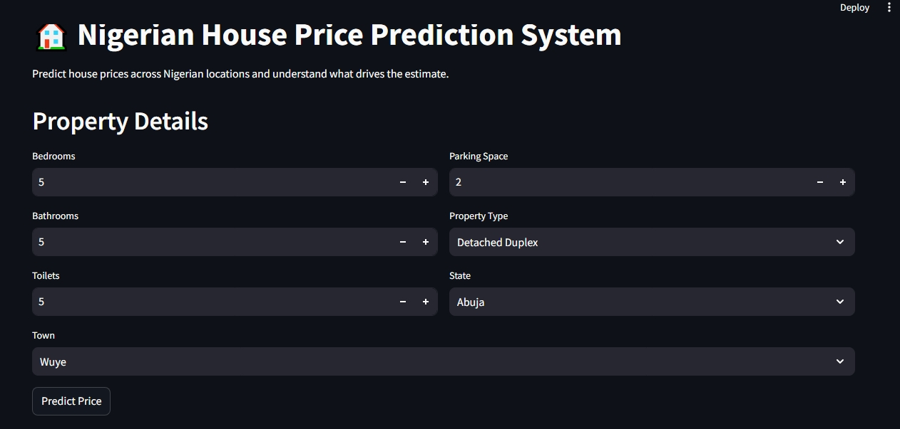
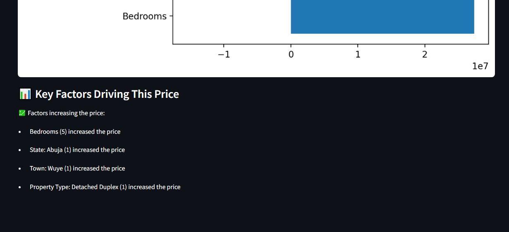

# 🏠 Nigerian House Price Prediction System

A machine learning-powered web application that predicts house prices in Nigeria based on property features and location, with explainable AI insights.

---

## 📌 Project Overview

This project uses machine learning to estimate house prices across different Nigerian locations. Users can input property details such as number of bedrooms, bathrooms, property type, and location (town and state), and receive a predicted price along with an explanation of the key factors influencing the prediction.

The system is deployed as an interactive web app using Streamlit.

---

## 🚀 Features

- ✅ Predict house prices instantly  
- ✅ Supports multiple Nigerian states and towns  
- ✅ Uses real property features (bedrooms, bathrooms, etc.)  
- ✅ Explainable AI using SHAP  
- ✅ Human-readable explanations (not just graphs)  
- ✅ Clean and interactive UI  

---

## 🧠 Machine Learning Approach

### Model Used:
- Random Forest Regressor

### Why Random Forest?
- Handles non-linear relationships effectively  
- Performs well on structured/tabular data  
- Requires minimal preprocessing  
- More robust compared to linear models in this case  

---

## 🔍 Key Findings

- 📍 Location is the strongest factor influencing house prices  
- 🏙️ High-demand areas like Lagos and Abuja significantly increase prices  
- 🛏️ Property features like bedrooms also contribute meaningfully  
- ❌ Linear Regression performed poorly even after tuning  
- 🌳 Tree-based models (Random Forest) performed significantly better  

---

## ⚙️ Data Preprocessing

- Categorical features (`title`, `town`, `state`) were encoded using:
  - One-Hot Encoding  
- Numerical features were used directly  
- Feature consistency was maintained between training and deployment  

---

## 📊 Model Explainability

We used SHAP (SHapley Additive exPlanations) to interpret predictions.

### Improvements made:
- Only top important features are shown  
- Removed confusing negative contributions  
- Converted technical outputs into human-readable explanations  

### Example:

> “This property is priced this way mainly because it is located in Lekki, Lagos and has 5 bedrooms.”

---

## 🧪 Interesting Behavior (Validation Insight)

During testing:
- When a town was paired with the wrong state,  
  👉 the model relied more on the state  

This shows:
- The model learned real-world location importance  
- It prioritizes stronger signals (state over inconsistencies)  

---

## 🖥️ App Interface

Users can:
- Select:
  - Property type  
  - Town  
  - State  
- Input:
  - Bedrooms  
  - Bathrooms  
  - Toilets  
  - Parking space  

And get:
- 💰 Price prediction  
- 📊 Explanation of key factors  

---

## 📸 Screenshots

### 🔹 App Interface

### 🔹 Prediction Output

---

## 🛠️ Tech Stack

- Python  
- Pandas  
- Scikit-learn  
- SHAP  
- Streamlit  
- Matplotlib  
- Joblib  

## 📂 Project Structure
├── app.py
├── model.pkl (not included - see note below)
├── explainer.pkl (not included - see note below)
├── columns.pkl
├── requirements.txt
├── README.md
└── images/

---

## ⚡ Installation & Setup

### 1. Clone the repository

git clone https://github.com/your-username/your-repo-name.git

cd your-repo-name
### 2. Install dependencies
pip install -r requirements.txt

### 3. Run the app

streamlit run app.py

## 📦 Requirements
streamlit
pandas
numpy
scikit-learn==1.5.1
matplotlib
shap
joblib

---

## ⚠️ Important Notes

- Model files (`model.pkl`, `explainer.pkl`) are not included due to GitHub size limits  
- Ensure consistent `scikit-learn` version (recommended: 1.5.1)  
- You may need to retrain the model locally  

---

## 📈 Future Improvements

- Improve feature engineering  
- Handle multicollinearity explicitly  
- Add more real-world features (area size, property age, etc.)  
- Deploy on cloud (Streamlit Cloud / Railway / Render)  
- Enhance UI/UX  

---

## 🙌 Acknowledgment

This project was built as part of a hands-on machine learning journey focused on solving real-world problems.

---

## 📬 Contact

Feel free to connect for collaboration or feedback!
